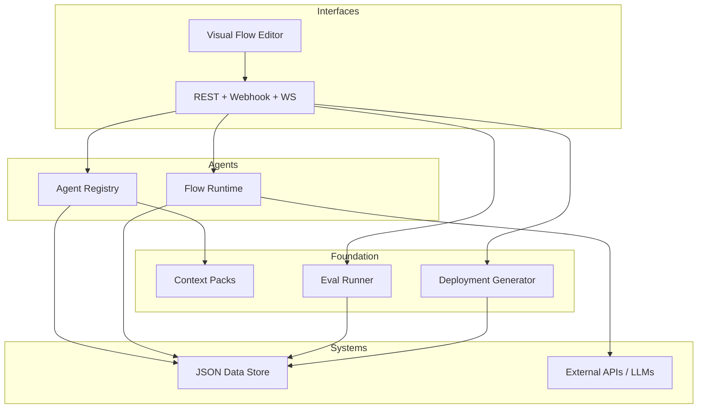

# Agent Builder OSS

Open-source static-first agent IDE for building and deploying block-based AI agents.

This project is designed as an OSS alternative to closed enterprise agent stacks, with practical capabilities across:

- Business context (`Context Packs`)
- Agent execution (`Flow Runtime + static deploy artifacts`)
- Evaluation and optimization (`Eval API`)
- Governance and deployment (`Cloudflare + GitHub direct deployment from browser`)

Mission: democratize and liberalize enterprise-grade agent operations so teams are not locked into closed managed control planes.

## Why this is Frontier-style, but OSS

- OSS by default (MIT)
- Full local control over data and runtime (`./data/*.json`)
- Bring-your-own model provider (user-configurable LLM endpoint in Deploy view)
- Agent abstraction on top of flows (identity, instruction, context links, permissions)
- Direct browser-side deploy to Cloudflare Workers
- Direct browser-side push to GitHub repositories

## Static-First Mode (Current Default)

- The editor works without a backend API for generation/deploy/save workflows.
- OAuth tokens are stored in browser session storage only.
- LLM flow generation runs directly against the user-configured chat-completions endpoint.
- Deploy and GitHub push run directly from browser to provider APIs.

Legacy `/api/*` backend behavior is disabled in this build unless you implement your own server variant.

## Quick Start

```bash
bun install
bun run dev
```

Open: `http://localhost:3000`

Environment variables (optional for static hosting):

```bash
export PORT=3000
export PUBLIC_BASE_URL=http://localhost:3000
```

Use Deploy view in the editor to set LLM endpoint/model/API key and connect GitHub/Cloudflare tokens.

## Architecture



Operational parity roadmap and section-by-section quality gates:

- `docs/frontier-oss-playbook.md`

## Core APIs

### Flows and Runs

- `GET /api/flows`
- `POST /api/flows`
- `GET /api/flows/:id`
- `PUT /api/flows/:id`
- `DELETE /api/flows/:id`
- `POST /api/flows/:id/run`
- `GET /api/runs/:id`
- `GET /api/runs/:id/pull?cursor=0`
- `POST /api/webhooks/:flowId`

### Context Packs (shared business context)

- `GET /api/context-packs`
- `POST /api/context-packs`
- `GET /api/context-packs/:id`
- `PUT /api/context-packs/:id`
- `DELETE /api/context-packs/:id`

Example:

```json
{
  "name": "Sales CRM Context",
  "description": "Shared context for inbound sales",
  "tags": ["sales", "crm"],
  "values": {
    "currency": "USD",
    "discountPolicy": {
      "maxManagerDiscountPct": 15
    }
  }
}
```

### Agents (identity + instruction + permissions)

- `GET /api/agents`
- `POST /api/agents`
- `GET /api/agents/:id`
- `PUT /api/agents/:id`
- `DELETE /api/agents/:id`
- `POST /api/agents/:id/run`
- `GET /api/agents/:id/operational`
- `GET /api/agents/:id/releases`
- `POST /api/agents/:id/finalize`

Agent runs automatically seed `vars.__context` and `vars.__contextPacks` from linked context packs.

Agents include policy controls (`policy`) for production safety:

- `minEvalPassRate`
- `requireReleaseForChat`
- `maxThreadMessages`

When `requireReleaseForChat=true`, agent runs and thread auto-run require a `released` record (not only eval+deploy artifacts).

`POST /api/agents/:id/finalize` is the production gate path:

- runs eval suite
- enforces pass-rate threshold
- generates deployment artifact
- writes release record (`released` or `blocked`)

### Evals (quality loops)

- `GET /api/evals`
- `POST /api/evals/flows/:id`
- `POST /api/evals/agents/:id`

Flow eval request:

```json
{
  "cases": [
    {
      "name": "basic",
      "input": { "items": [1, 2, 3] },
      "expectExpr": "Array.isArray(output) && output.length === 3",
      "maxDurationMs": 2500
    }
  ]
}
```

### Deployments (Cloudflare Workers)

- `GET /api/deployments`
- `GET /api/deployments/:id`
- `POST /api/deployments/cloudflare`
- `POST /api/deployments/cloudflare-elysia`

Create Worker artifact from an agent:

```json
{
  "agentId": "agent_xxx",
  "workerName": "inbound-sales-edge",
  "originUrl": "https://agent-builder.example.com",
  "route": "sales-edge.example.com/*",
  "waitForCompletion": false,
  "requireWorkerToken": true
}
```

The API generates a ready-to-deploy Worker project (including `wrangler.toml`) under:

- `./deployments/cloudflare/<worker>-<timestamp>/`

Then deploy:

```bash
cd deployments/cloudflare/<worker>-<timestamp>
bun install
bunx wrangler secret put AGENT_BUILDER_WEBHOOK_TOKEN
bunx wrangler secret put WORKER_AUTH_TOKEN
bun run deploy
```

Bun + Wrangler + Elysia deployment request:

```json
{
  "agentId": "agent_xxx",
  "workerName": "inbound-sales-edge-bun",
  "originUrl": "https://agent-builder.example.com",
  "route": "sales-edge.example.com/*",
  "waitForCompletion": false,
  "requireWorkerToken": true,
  "includeOpsConsole": true
}
```

Bun deploy:

```bash
cd deployments/cloudflare/<worker>-<timestamp>
bun install
bunx wrangler secret put AGENT_BUILDER_WEBHOOK_TOKEN
bunx wrangler secret put WORKER_AUTH_TOKEN
bun run deploy
```

### Ops Prompt Console

- UI: `/ops-console.html`
- Prompt templates: `GET /api/ops/prompts`
- Prompt execution: `POST /api/ops/prompts/:id/execute`

Built-in one-click prompts:

- `agent_run_wait`
- `agent_eval_quick`
- `deploy_cf_elysia`
- `finalize_agent`

### Threads (OpenAI-like conversation model)

- `GET /api/threads?agentId=...`
- `POST /api/threads`
- `GET /api/threads/:id`
- `PATCH /api/threads/:id`
- `DELETE /api/threads/:id`
- `GET /api/threads/:id/messages`
- `POST /api/threads/:id/messages`

`POST /api/threads/:id/messages` with `role=user` and `autoRun=true` appends user message, runs agent, and appends assistant reply with run linkage.

### Audit Logs

- `GET /api/audit-logs`
- `GET /api/audit-logs/export.ndjson`

Use filters:

- `action`
- `entityType`
- `outcome`
- `limit`

### ChatGPT-Like Agent Frontend

- UI: `/chat-agents.html`
- Left panel: finalized agents list (default filter: finalized only)
- Left panel: finalized agents + persistent thread list
- Center: chat thread + prompt composer
- Right panel: eval/deployment status and agent metadata
- Built-in `Finalize + Deploy (Bun/Elysia)` button uses:
  - `POST /api/agents/:id/finalize`

Chat prompt execution uses:

- `POST /api/threads/:id/messages` with `autoRun=true`

## Node Types

- `start`, `end`
- `http`
- `openai_structured`
- `if`, `while`, `for_each`
- `transform`, `set_var`, `template`
- `json_parse`, `json_stringify`, `array_push`
- `delay`, `assert`, `log`

## Data Layout

Runtime data is stored in `DATA_DIR` (`./data` by default):

- `flows.json`
- `runs.json`
- `agents.json`
- `contextPacks.json`
- `evalRuns.json`
- `deployments.json`
- `threads.json`
- `threadMessages.json`
- `agentReleases.json`
- `auditLogs.json`

## OSS

- License: [MIT](./LICENSE)
- Contributions: PRs welcome
