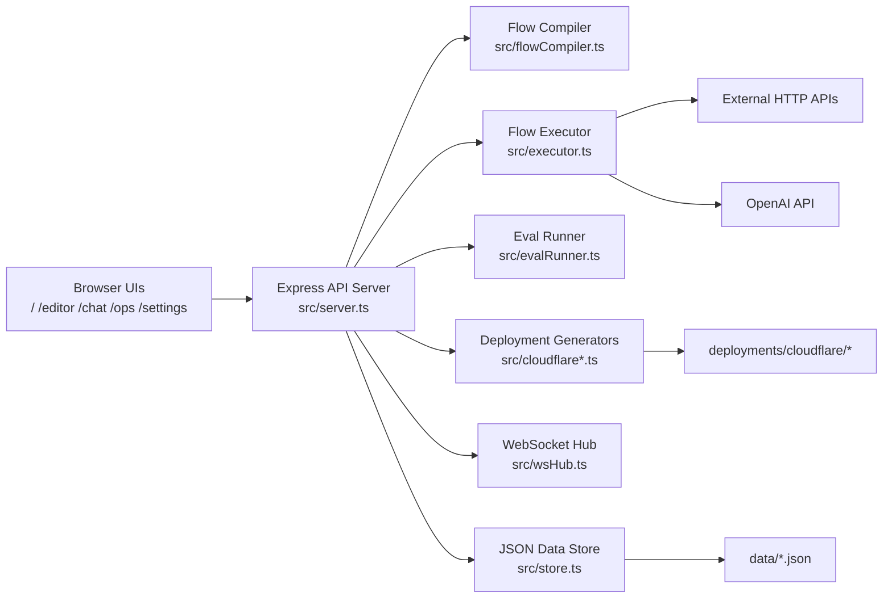

# CANARIA Project Deep Dive

This document explains the full project as implemented in this repository: architecture, runtime behavior, APIs, UI surfaces, deployment pipeline, data model, and operational controls.

## 1. Project Summary

CANARIA is an open-source "agent operations" platform for:

- Building agent workflows visually (Drawflow-based canvas).
- Running workflows and agents with event streaming.
- Evaluating quality via eval suites.
- Finalizing agents through release gates.
- Generating deployable Cloudflare Worker artifacts.
- Operating chat threads and prompt-driven ops actions.

The runtime is file-backed by default (`./data/*.json`) and is designed for local/self-hosted usage.

## 2. High-Level Architecture



## 3. Tech Stack

- Language: TypeScript (`src/*.ts`), compiled to `dist/*.js`.
- Server: Express + Node HTTP + WebSocket (`ws`).
- Runtime tooling: Bun scripts (`bun run dev`, `bun run build`), Node 20+ compatible output.
- LLM: OpenAI SDK (`openai`) for `openai_structured` nodes and flow-generation endpoint.
- Frontend: Vanilla JS + HTML + CSS, Drawflow for visual graph editing.
- Persistence: JSON files with atomic write-via-temp-file rename.

## 4. Repository Layout

- `src/`: backend implementation.
- `public/`: UI pages and scripts.
- `data/`: default runtime data store (sample flows/runs in repo).
- `data-smoke/`: smoke-test dataset snapshot.
- `deployments-smoke/`: sample generated deployment artifact.
- `dist/`: compiled server/runtime output.
- `docs/frontier-oss-playbook.md`: roadmap and quality gate playbook.
- `skills/`: optional Codex skills/scripts included with this repo.

## 5. Backend Internals

### 5.1 Server Orchestration (`src/server.ts`)

`src/server.ts` is the central control plane. It:

- Boots Express and static file serving.
- Initializes `DataStore`.
- Starts a WebSocket hub at `/ws`.
- Exposes all REST endpoints.
- Coordinates run execution, evals, releases, deployments, threads, and audit logging.
- Applies optional in-memory rate limits and audit logging.

Core runtime maps:

- `activeRuns: Map<runId, Promise<void>>` tracks in-flight run tasks.
- In-memory rate-limit buckets keyed by `scope:clientIp`.

### 5.2 Data Store (`src/store.ts`)

`DataStore` is a file-backed repository layer.

- Loads JSON files on startup.
- Maintains in-memory indexes for flows/runs/agents/etc.
- Persists changes through a serialized `saveChain` to reduce write races.
- Writes use `<file>.tmp` then rename for atomic replacement.
- Audit log is capped at 10,000 entries.

Supported entities:

- Flows, runs, agents, context packs, eval runs, deployments.
- Threads and thread messages.
- Agent releases.
- Audit logs.

### 5.3 Flow Compiler (`src/flowCompiler.ts`)

Compiles Drawflow export JSON into runtime graph format:

- Normalizes node type aliases (`for`, `foreach`, `openai`, `py`, `ts`, etc.).
- Converts Drawflow output ports (`output_1`, `output_2`) into semantic ports (`true/false`, `loop/done`, `next`).
- Picks entry node as explicit `start` if present, otherwise first node by numeric id.

### 5.4 Flow Executor (`src/executor.ts`)

`executeFlowRun()`:

- Compiles flow.
- Seeds context (`input`, `vars`, `last`, optional `output`).
- Emits ordered events (`run_started`, `node_started`, `node_completed`, `node_log`, `run_completed`, `run_failed`).
- Traverses node-by-node with `maxSteps` safety.
- Supports branch ports and first-target selection for fanout.

Node support:

| Node Type | Purpose | Key Config |
| --- | --- | --- |
| `start` | Entry node | none |
| `end` | Stop + return | `returnExpr` |
| `set_var` | Assign variable | `varName`, `expression` or `value` |
| `transform` | Evaluate expression | `expression`, `storeAs` |
| `log` | Emit runtime log event | `message` |
| `template` | Interpolate `{{ }}` placeholders | `template`, `parseJson`, `storeAs` |
| `delay` | Sleep/pause | `msExpr` or `ms`, `storeAs` |
| `assert` | Fail run if condition false | `condition`, `message` |
| `json_parse` | Parse JSON safely | `sourceExpr`, `onError`, `storeAs` |
| `json_stringify` | Serialize to JSON | `sourceExpr`, `indent`, `storeAs` |
| `array_push` | Append to array var | `arrayVar`, `valueExpr`, `unique`, `maxLength` |
| `http` | HTTP request node | `method`, `url`, `headers`, `body`, `timeoutMs`, `storeAs` |
| `openai_structured` | Structured JSON response from OpenAI | `model`, `systemPrompt`, `userPrompt`, `schemaName`, `schema`, `storeAs` |
| `if` | Boolean branch | `condition` |
| `while` | Loop with cap | `condition`, `maxIterations` |
| `for_each` | Array iteration | `itemsExpr`, `itemVar`, `indexVar` |
| `python_script` | Run `python3` snippet sync | `code`, `timeout`, `storeAs` |
| `typescript_script` | Run JS/TS-like code in VM | `code`, `timeout`, `storeAs` |

Runtime notes:

- Expression evaluation uses Node `vm` with short timeouts.
- `openai_structured` requires server-side `OPENAI_API_KEY`.
- `python_script` requires `python3` available on host.

### 5.5 Eval Runner (`src/evalRunner.ts`)

`runFlowEvalSuite()` executes per-case runs and produces:

- case-level pass/fail, duration, output/error.
- optional assertion value (`expectExpr`).
- optional duration threshold check (`maxDurationMs`).
- summary with pass rate.

### 5.6 Deployment Generators

Two generators:

- `src/cloudflareDeployment.ts`: classic Cloudflare Worker forwarder.
- `src/cloudflareElysiaDeployment.ts`: Bun + Wrangler + Elysia worker scaffold (optional mini ops console).

Generated artifact includes:

- `src/index.ts`
- `wrangler.toml`
- `package.json`
- `tsconfig.json`
- `.dev.vars.example`
- `README.md`
- Optional `public/*` console assets for Elysia mode.

Generated workers:

- expose `/invoke` and `/health`.
- forward to CANARIA webhook endpoint `/api/webhooks/:flowId`.
- sanitize forwarded headers.
- optionally enforce `x-worker-token` auth.

### 5.7 WebSocket Hub (`src/wsHub.ts`)

WebSocket endpoint: `/ws`

Protocol:

- Client sends `{ "type": "subscribe", "runId": "..." }` or `unsubscribe`.
- Server emits `{ "type": "run.event", "runId": "...", "payload": RunEvent }`.

Used by editor/runtime UI for live run event streaming.

## 6. API Surface

### 6.1 System

- `GET /health`

### 6.2 Webhooks and Runs

- `POST /api/webhooks/:flowId` (raw body, optional bearer auth)
- `POST /api/flows/:id/run`
- `GET /api/runs/:id`
- `GET /api/runs/:id/pull?cursor=0`

### 6.3 Flows

- `GET /api/flows`
- `POST /api/flows`
- `GET /api/flows/:id`
- `PUT /api/flows/:id`
- `DELETE /api/flows/:id`
- `POST /api/flows/generate` (LLM-assisted Drawflow generation)

### 6.4 Context Packs

- `GET /api/context-packs`
- `POST /api/context-packs`
- `GET /api/context-packs/:id`
- `PUT /api/context-packs/:id`
- `DELETE /api/context-packs/:id`

### 6.5 Agents and Release Pipeline

- `GET /api/agents`
- `POST /api/agents`
- `GET /api/agents/:id`
- `PUT /api/agents/:id`
- `DELETE /api/agents/:id`
- `POST /api/agents/:id/run`
- `GET /api/agents/:id/operational`
- `GET /api/agents/:id/releases`
- `POST /api/agents/:id/finalize`

`finalize` performs:

1. Eval suite.
2. Pass-rate gate.
3. Deployment artifact generation.
4. Release record write (`released` or `blocked`).

### 6.6 Evals

- `GET /api/evals`
- `POST /api/evals/flows/:id`
- `POST /api/evals/agents/:id`

### 6.7 Threads and Messages

- `GET /api/threads?agentId=...&status=...`
- `POST /api/threads`
- `GET /api/threads/:id`
- `PATCH /api/threads/:id`
- `DELETE /api/threads/:id`
- `GET /api/threads/:id/messages`
- `POST /api/threads/:id/messages`

Message auto-run behavior:

- User message with `autoRun=true` executes agent synchronously, appends assistant response, and returns run metadata.

### 6.8 Ops Prompt Templates

- `GET /api/ops/prompts`
- `POST /api/ops/prompts/:id/execute`

Built-in prompt ids:

- `agent_run_wait`
- `agent_eval_quick`
- `deploy_cf_elysia`
- `finalize_agent`

### 6.9 Deployments

- `GET /api/deployments`
- `GET /api/deployments/:id`
- `POST /api/deployments/cloudflare`
- `POST /api/deployments/cloudflare-elysia`

### 6.10 Audit

- `GET /api/audit-logs`
- `GET /api/audit-logs/export.ndjson`

### 6.11 Proxy Helpers (Browser-side CORS workflows)

- `POST /api/proxy/cf-test`
- `POST /api/proxy/cf-deploy`
- `POST /api/proxy/github-repos`
- `POST /api/proxy/github-push`

These are utility routes for UI workflows using browser-stored credentials.

## 7. Frontend Surfaces

### 7.1 Landing (`/` -> `public/index.html`)

- Marketing/overview page with links to product surfaces.
- Animated feature cards and long-form inline feature explanations.
- Theme toggle and service worker registration.

### 7.2 Editor (`/editor` -> `public/editor/index.html`, logic in `public/app.js`)

Contains 3 modes:

- Chat mode: prompt-to-flow generation UX.
- Canvas mode: Drawflow visual editing, node inspector, run controls, websocket event feed.
- Deploy mode: UI for save/deploy/push helper actions.

Important: `public/app.js` includes some legacy/experimental calls that do not fully match current server contracts (see caveats section).

### 7.3 Chat Console (`/chat` -> `public/chat/index.html`, `public/chat-agents.js`)

Primary production chat UI:

- Select agent and thread.
- Send user messages.
- Auto-run through `/api/threads/:id/messages`.
- View operational state, eval/deploy/release info.
- Trigger finalize pipeline from UI.

### 7.4 Ops Console (`/ops` -> `public/ops/index.html`, `public/ops-console.js`)

- Renders prompt templates from `/api/ops/prompts`.
- Lets operators patch JSON payload per template.
- Executes prompt template flows against selected agent/flow context.

### 7.5 Settings (`/settings` -> `public/settings/index.html`, `public/settings.js`)

- Stores GitHub/Cloudflare/OpenAI keys in browser `localStorage`.
- Tests external connectivity (GitHub direct, Cloudflare via proxy route).
- Manages theme and clears local settings.

### 7.6 Shared UI Utilities

- `public/auth-ui.js`: nav indicators + settings shortcut injection.
- `public/toast.js`: global toast notifications.
- `public/sw.js`: service worker caching strategy.
- `public/design-system.css`: shared design tokens/components.

### 7.7 Legacy/Duplicate UI Files

Also present:

- `public/chat-agents.html`
- `public/ops-console.html`

The server routes `/chat` and `/ops` point to `public/chat/index.html` and `public/ops/index.html` respectively.

## 8. Data Model and Persistence

Default data directory: `./data` (configurable via `DATA_DIR`).

Entity files:

- `flows.json`
- `runs.json`
- `agents.json`
- `contextPacks.json`
- `evalRuns.json`
- `deployments.json`
- `threads.json`
- `threadMessages.json`
- `agentReleases.json`
- `auditLogs.json`

Relationship summary:

- Agent -> one flow (`flowId`).
- Agent -> many context packs (`contextPackIds`).
- Run -> one flow, optional agent.
- Eval -> one flow, optional agent.
- Deployment -> one flow, optional agent.
- Release -> one agent + one flow + eval/deployment linkage.
- Thread -> one agent, optional linked release snapshot.
- ThreadMessage -> one thread, optional linked run.

## 9. Agent Lifecycle

Typical lifecycle:

1. Create flow.
2. Create agent linked to flow.
3. Optionally attach context packs and policy.
4. Run eval suite.
5. Finalize agent:
   - verify eval pass rate.
   - generate deployment artifact.
   - write release record.
6. Use chat threads (gated by release policy unless overridden).

Policy defaults:

- `minEvalPassRate = 100`
- `requireReleaseForChat = true`
- `maxThreadMessages = 500`

## 10. Security and Operational Controls

Implemented controls:

- Optional webhook bearer token (`WEBHOOK_BEARER_TOKEN`) for `/api/webhooks/:flowId`.
- Release gate enforcement on agent/thread auto-runs.
- Thread message count limits via agent policy.
- In-memory rate limiting for:
  - thread message endpoint,
  - ops prompt execution,
  - finalize endpoint.
- Audit logging for key actions and outcomes.
- Edge artifact auth (`x-worker-token`) optional but default-enabled in finalize/deploy payloads.
- Header sanitization in generated worker forwarders.

## 11. Environment Variables

| Variable | Default | Purpose |
| --- | --- | --- |
| `PORT` | `3000` | HTTP listen port |
| `HOST` | `0.0.0.0` | Bind host |
| `PORT_FILE` | unset | Optional file path to write actual bound port |
| `DATA_DIR` | `./data` | JSON datastore directory |
| `DEPLOYMENTS_DIR` | `./deployments/cloudflare` | Artifact output directory |
| `PUBLIC_BASE_URL` | inferred from request | Canonical origin for generated URLs |
| `OPENAI_API_KEY` | unset | Required for `openai_structured` node and `/api/flows/generate` |
| `WEBHOOK_BEARER_TOKEN` | unset | Optional webhook auth |
| `AUDIT_LOG_ENABLED` | `true` | Enable audit logging |
| `RATE_LIMIT_ENABLED` | `true` | Enable in-memory rate limits |
| `TRUST_PROXY` | `false` | Express trust proxy mode |
| `RATE_LIMIT_WINDOW_MS` | `60000` | Rate limit window |
| `THREAD_MESSAGE_RATE_LIMIT` | `60` | Max thread message requests/window per IP |
| `OPS_PROMPT_RATE_LIMIT` | `40` | Max ops prompt requests/window per IP |
| `AGENT_FINALIZE_RATE_LIMIT` | `10` | Max finalize requests/window per IP |

## 12. Build and Run

Install and run:

```bash
bun install
bun run dev
```

Other scripts:

```bash
bun run check
bun run build
bun run start
```

## 13. Extensibility Guide

### 13.1 Add a New Node Type

Update at least:

- `src/types.ts` (`NodeType` union).
- `src/executor.ts` (execution behavior).
- `src/flowCompiler.ts` (optional alias mapping/port mapping).
- `public/app.js` (`NODE_CATALOG`, inspector fields, palette grouping).

### 13.2 Add a New API Capability

Update:

- `src/server.ts` route handlers.
- `src/store.ts` for persistence model, if needed.
- Relevant UI script in `public/*`.

### 13.3 Add a New Deployment Target

Pattern:

- Add generator module similar to `cloudflareDeployment.ts`.
- Add target type in `src/types.ts`.
- Add route wiring and finalize integration in `src/server.ts`.

## 14. Included Operational Assets

- `docs/frontier-oss-playbook.md`: production-hardening and roadmap checklist.
- `data-smoke/`: sample data snapshot for smoke scenarios.
- `deployments-smoke/`: example generated worker artifact.
- `skills/`: optional codex automation skills and scripts.

## 15. Notable Caveats (Current Snapshot)

1. `public/app.js` deploy/chat helper paths include legacy calls that do not align with current API contracts (for example, `/api/agents/:id/chat` and agent creation payload shape in deploy mode).
2. The primary supported chat/ops experiences are the dedicated pages and scripts:
   - `/chat` with `public/chat-agents.js`
   - `/ops` with `public/ops-console.js`
3. Datastore is file-based and single-process-oriented; concurrent multi-instance writes are not coordinated.
4. Rate limiting is in-memory and resets on process restart.
5. Browser settings store keys in `localStorage`; server runtime still needs environment variables for server-side OpenAI calls.

## 16. Where to Start Reading the Code

If you are new to the codebase, read in this order:

1. `src/server.ts`
2. `src/store.ts`
3. `src/flowCompiler.ts`
4. `src/executor.ts`
5. `public/chat-agents.js`
6. `public/ops-console.js`
7. `public/app.js` (editor internals and legacy sections)

