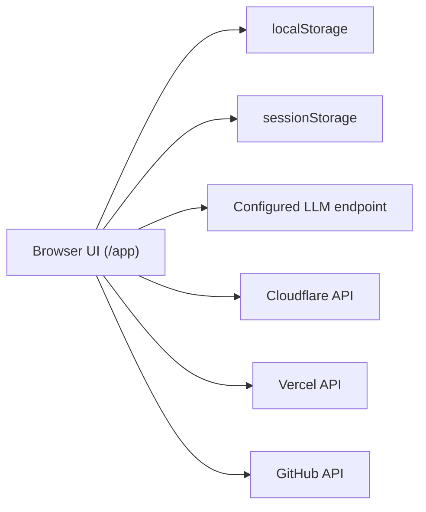

# CANARIA Deep Dive (Frontend-Only)

This repository now ships as a frontend-only static IDE.

## 1. Runtime Model

- Browser app only
- No internal `/api/*` runtime
- No project-owned backend server required for IDE workflows
- `/api/index.ts` exists only in generated Vercel deployment artifacts (not in the IDE runtime)

## 2. Main Files

- `public/app/index.html`: primary app shell
- `public/app.js`: core IDE logic
- `public/settings.js`: settings + provider profiles
- `public/ide-runtime.js`: deploy-target and provider helpers
- `public/sw.js`: service worker cache strategy
- `public/sw-register.js`: registration/update/localhost cleanup

## 3. Storage

- `localStorage`: flows, agents, deploy logs, UI preferences
- `sessionStorage`: tokens and API keys
- Auth tokens for generated agents are not managed by IDE after scaffold; users configure platform secrets directly.

## 4. Build and Dev

- `npm run dev`: Vite dev server
- `npm run build`: production static bundle in `dist/`
- `npm run preview`: preview built output

## 5. Routing

Canonical route:

- `/app`

Legacy routes retained as redirects:

- `/editor` -> `/app`
- `/chat` -> `/app/?mode=chat`
- `/ops` -> `/app/?mode=deploy`
- `/settings` -> `/app/?mode=settings`

## 6. Deployability

`dist/` output is deployable as static hosting artifact (Cloudflare Pages, GitHub Pages, Netlify, S3, etc.).

GitHub Pages automation is included via `.github/workflows/deploy-pages.yml` (push to `main`/`master`).

Direct provider deploy calls are best-effort from browser; if CORS/network blocks a direct call, IDE falls back to generating the deploy object.
